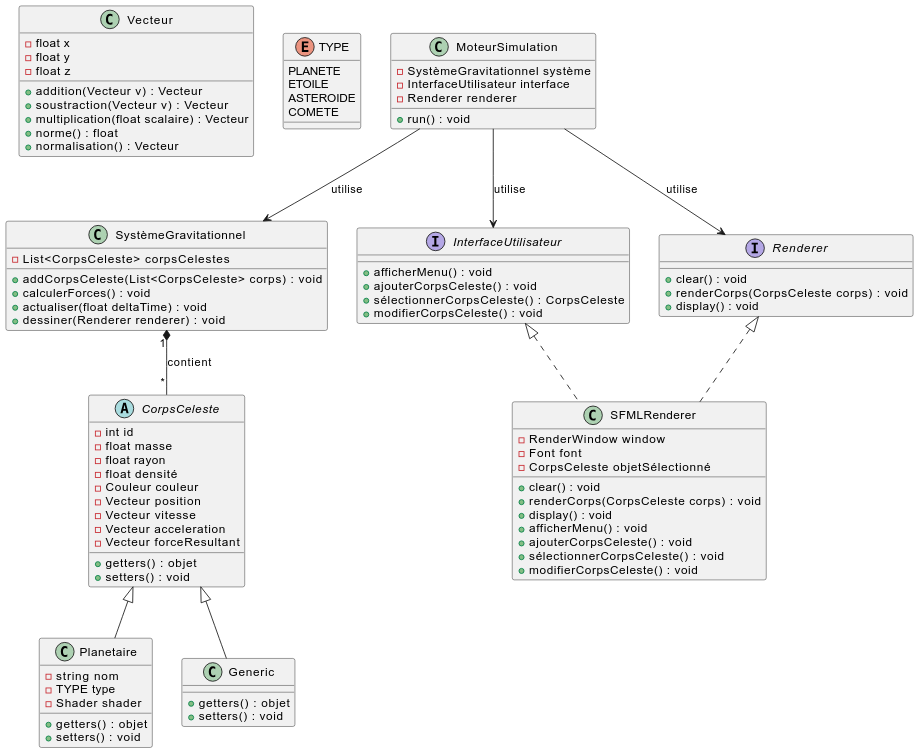

<div align="center">

<h1>Gravitas</h1>

[](https://github.com/dan-lara/Gravitas/blob/master/README.md)
[](https://github.com/dan-lara/Gravitas/blob/master/README.fr.md)
---

</div>

Gravitas est un simulateur des lois de la gravitation des corps célestes développé en C++ avec modélisation 3D des objets et visualisation 2D.

## Table des matières
- [Introduction](#introduction)
- [Fonctionnalités](#fonctionnalités)
- [Installation](#installation)
- [Utilisation](#utilisation)
- [Diagramme UML](#diagramme-uml)
- [Contribuer](#contribuer)
- [Licence](#licence)

## Introduction
Gravitas est un outil puissant pour simuler les interactions gravitationnelles entre les corps célestes. Il est conçu à la fois pour des fins éducatives et de recherche.

## Fonctionnalités
- Modélisation 3D des corps célestes
- Visualisation 2D des interactions gravitationnelles
- Développé en C++ pour des performances élevées

## Installation
Pour installer Gravitas, suivez ces étapes :
1. Clonez le dépôt :
    ```sh
    git clone https://github.com/dan-lara/Gravitas.git
    ```
2. Accédez au répertoire du projet :
    ```sh
    cd Gravitas
    ```
3. Construisez le projet en utilisant CMake :
    ```sh
    mkdir build
    cd build
    cmake ..
    make
    ```

## Utilisation
Pour exécuter le simulateur, exécutez la commande suivante depuis le répertoire de build :
```sh
./Gravitas
```

## Diagramme UML


## Contribuer
Les contributions sont les bienvenues ! Veuillez lire les [directives de contribution](CONTRIBUTING.md) pour plus d'informations.

## Licence
Ce projet est sous licence MIT. Voir le fichier [LICENCE](LICENSE) pour plus de détails.